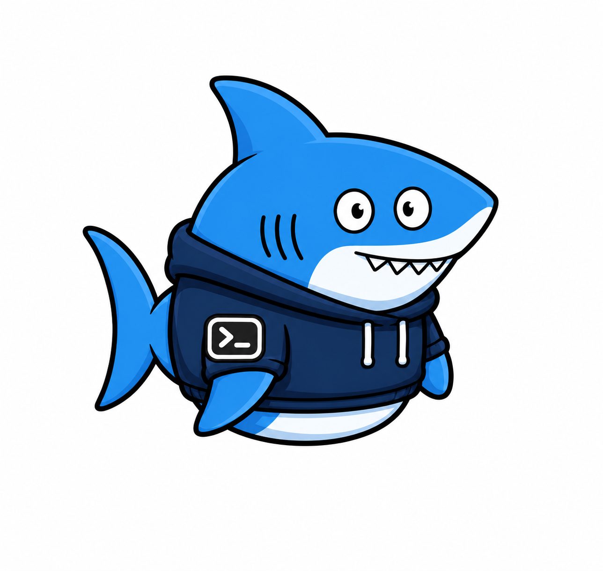

<div align="center">
  
  <h1>Codex-codeshark</h1>
  <p><strong>Your Codex agent, on call from anywhere.</strong></p>
  <p>
    Hand off repo work, investigations, and recurring checks.<br>
    Codeshark runs on your Mac, learns how you work, and returns the finished result.
  </p>
  <p>
    <a href="https://github.com/Younghegalian/codeshark/actions/workflows/tests.yml"></a>
    <a href="https://www.python.org/"></a>
    <a href="https://www.apple.com/macos/"></a>
    <a href="LICENSE"></a>
    <a href="pyproject.toml"></a>
  </p>
  <p>
    <a href="#quick-start">Quick start</a> ·
    <a href="#what-it-can-do">Capabilities</a> ·
    <a href="#security-defaults">Security</a> ·
    <a href="docs/telegram.md">Chat interface</a> ·
    <a href="#development">Development</a>
  </p>
</div>

Codex-codeshark turns the OpenAI Codex CLI already installed on your Mac into a persistent local agent. Give it an outcome, not a sequence of button clicks: it can inspect and modify approved projects, run commands, work from attached files, keep context across tasks, and follow up later on a schedule. Telegram provides the current remote chat interface; reasoning, tools, project access, memory, and automation run in the local agent runtime.

> [!IMPORTANT]
> Codex-codeshark is tuned for one administrator and one Mac, with local runtime state and server-controlled project access.

## What it can do

| Capability | What you get |
|---|---|
| Project work | Inspect, edit, test, and diagnose code inside a private workspace, explicitly delegated project roots, or Codeshark's own checked-out repository. |
| Project-scoped context | Continue a separate Codex session for each named project across requests and process restarts. |
| Durable memory | Keep long-term memories and assistant assets scoped to the active project; load only that project's records. |
| Global identity and skills | Keep Codeshark's name, owner profile, and reusable skills available across projects without mixing project facts. |
| Scheduled follow-through | Run one-time reminders, heartbeat checks, and cron jobs in clean ephemeral sessions. |
| File-based investigation | Accept photos and documents as task context through a size-limited private inbox. |
| Result delivery | Ask for a result file, PDF, or final deliverable, and receive an allowed workspace or project file as a Telegram document in the final response. |
| Guarded execution | Keep unapproved work read-only and require explicit approval before mutation or external side effects. |
| Isolated group analysis | Let directly addressed group members research and create sandbox-only analysis files without exposing private projects, tools, or administrator context. |
| Service-grade operation | Run up to three independent tasks concurrently, persist queued work, recover interrupted tasks, retry failed result delivery, rotate bounded data, and expose diagnostics and logs. |

The useful unit is a finished task:

```text
Fix the failing authentication tests in my API project and summarize the diff.
Read this error log, find the root cause, and tell me the smallest safe fix.
Every weekday at 09:00, check whether the local service is healthy.
Remember that this repo uses conventional commits and never squashes migrations.
```

It uses your existing Codex login, needs no separate model API key, and adds zero runtime dependencies.

## How it works

```text
Natural-language request or file
              |
              v
     Durable queue + risk gate
              |
              v
   Persistent or ephemeral Codex run
              |
       +------+------------------+
       |                         |
       v                         v
Approved local projects   Memory, skills, schedules,
and allowlisted tools     feedback, and bounded state
       |                         |
       +------------+------------+
                    v
              Final result
```

Interactive work continues a persisted Codex thread within the active project. Use `/project NAME` to switch: each project has its own temporary Codex session, long-term memories, and assistant assets. `/clear_temp` (or `/new`) deletes only the current project's temporary session; it never deletes long-term records. A safe private-chat follow-up sent during an active task steers that live Codex turn only when it belongs to the same active project. Scheduled work retains the project selected when it was created and runs ephemerally. Up to three independent tasks run concurrently, while tasks that share a persistent chat session remain serialized. The queue survives service restarts.

## Quick start

### Requirements

- macOS
- Python 3.11 or newer
- [Codex desktop](https://openai.com/codex/) with Codex CLI 0.138.0 or newer
- An active Codex login
- A bot token created with [BotFather](https://t.me/BotFather)

### 1. Install

Run this one command in Terminal:

```bash
curl -fsSL https://raw.githubusercontent.com/Younghegalian/codeshark/main/scripts/install.sh | sh
```

It installs or fast-forwards Codeshark in `~/.codeshark`, then runs guided setup, the live diagnostic, and the background service. The only interactive steps are intentionally private: enter the BotFather token at a hidden prompt and send the displayed `/pair` command from your Telegram account. The token is stored only in macOS Keychain.

To use another installation directory, set `CODESHARK_INSTALL_DIR` before running the command. If an existing checkout has local edits, the installer stops rather than overwriting them.

For a source checkout instead, clone the repository and run the same installer from its root:

```bash
git clone https://github.com/Younghegalian/codeshark.git Codex-codeshark
cd Codex-codeshark
CODESHARK_INSTALL_DIR="$PWD" ./scripts/install.sh
```

### 2. Manual setup (optional)

```bash
PYTHONPATH=src python3 -m codex_codeshark setup
```

The guided setup verifies Codex, stores the bot token in macOS Keychain, pairs one administrator, creates the isolated runtime profiles, and writes the private local configuration.

See the [chat interface guide](docs/telegram.md) for pairing, commands, optional group access, and delivery troubleshooting.

### 3. Manual verify and start (optional)

```bash
PYTHONPATH=src python3 -m codex_codeshark doctor
PYTHONPATH=src python3 -m codex_codeshark start
PYTHONPATH=src python3 -m codex_codeshark service-status
```

Use foreground mode for the first test if you prefer:

```bash
PYTHONPATH=src python3 -m codex_codeshark run
```

Service operations use the same CLI:

```bash
PYTHONPATH=src python3 -m codex_codeshark logs --lines 100
PYTHONPATH=src python3 -m codex_codeshark restart
PYTHONPATH=src python3 -m codex_codeshark stop
```

## Memory that compounds

After a successful private task, the agent can identify a durable preference, working pattern, project fact, or reusable procedure. Approved memories become searchable context; approved skills are selected by relevance and loaded only when needed.

Automatic learning is evidence-bound. An exact, non-secret statement from the current administrator request may be applied immediately. Inferred or transformed candidates remain pending for review. One-off details, speculation, credentials, and unnecessary sensitive data are excluded.

Stable names update existing records rather than creating unbounded duplicates. Usage and explicit positive or negative feedback help rank equally relevant knowledge. Guest and scheduled runs never feed the learning loop.

Use `/save KIND | TITLE | CONTENT` for durable structured facts that are broader than a one-line preference. Supported kinds are `project`, `person`, `commitment`, `decision`, `preference`, and `knowledge`. `/vault [QUERY]` lists relevant records and `/forget_asset ID` removes one. Vault records are private administrator context and never enter a group request.

## Security defaults

Connecting an agent to local projects deserves a small, inspectable trust boundary:

- Exactly one paired administrator receives the same memory, tools, and control commands in private chat or an enabled group. Each administrator chat retains its own persistent Codex session.
- Non-administrator group requests are ephemeral, MCP-disabled, and confined to a separate sandbox; they may perform ordinary network research and create or modify only sandbox files.
- Administrator mutations and external work wait for explicit approval; non-administrator writes are limited to the isolated group sandbox.
- Project roots are fixed in local configuration and can never be supplied by a remote request.
- The child process receives a strict environment allowlist; parent credentials and SSH-agent sockets are not forwarded.
- Network access is disabled by default and set explicitly for every run.
- MCP servers and tools are disabled unless represented in the local allowlist; inventory mismatches fail closed.
- Attachments are size-limited, privately stored, and confined to the agent inbox.
- Non-administrator group requests use a separate Codex home, an ephemeral session, no personal context or tools, and a workspace cleared after each run.
- Queues, sessions, memories, skills, feedback, schedules, attachments, and failed deliveries all have retention bounds.
- The background service runs a private versioned source snapshot instead of importing executable code from a delegated project tree.

See [SECURITY.md](SECURITY.md) for the full threat boundary, credential handling, and vulnerability reporting policy.

## Configuration and tool policy

`setup` writes a gitignored `config.local.toml`. Remote requests cannot change its paths or execution policy.

Codeshark always identifies its own checked-out repository as a server-controlled root. It can inspect that source for self-maintenance requests and, after the normal administrator approval gate, modify it without requiring the owner to expose a new root through Telegram.

Delegate one or more local project roots:

```toml
delegated_roots = ["/Users/yourname/workspace"]
```

Set the local parallel execution limit from one to three workers:

```toml
worker_count = 3
```

Persistent tasks from one chat still run in order to protect that chat's Codex session. Isolated group requests from different members may use separate worker slots.

Keep read-only inspection roots separate:

```toml
read_only_roots = ["/Users/yourname/Documents/reference"]
```

MCP access is allowlist-based:

```toml
[mcp_policy]
known_servers = ["github", "docs"]

[mcp_policy.allowed_tools]
docs = ["search", "fetch"]
# github is known but disabled
```

Startup fails when the live MCP inventory and local policy do not match. No server or tool is enabled automatically. See [config.example.toml](config.example.toml) for the full schema.

### Administrator full access

The secure default keeps unapproved private work read-only. Set the following only when the paired administrator deliberately wants the bot to act as a full local delegate:

```toml
admin_full_access = true
```

In this mode, the paired administrator's tasks use Codex `danger-full-access` with no approval pause in private chat and administrator-enabled groups. The agent can create files outside delegated roots, use live network access, install Codex plugins, and enable configured MCP servers. Other group members remain direct-address-only (mention or reply), ephemeral, MCP-disabled, and confined to the separate group sandbox. Do not enable this mode for a shared account or a bot exposed to untrusted private users.

## Bounded state and migration

The agent stores only what it needs to resume useful work:

| Store | Bound |
|---|---|
| Temporary project session | One persisted Codex session per chat and named project; rotated at `max_session_turns` after a durable summary proposal is persisted. |
| Scheduled and guest runs | Ephemeral; their Codex sessions are not retained. |
| Task history | Raw prompts are cleared at terminal status; 200 terminal records remain. |
| Long-term memory | 12,000 characters by default across project-scoped records, with 1,000 characters per item. |
| Skills | At most 100 approved skills, up to 8,000 characters each. |
| Scheduled jobs | At most 100 active jobs and 200 terminal records. |
| Attachments | The 50 newest gateway-managed files. |
| Feedback | Rotates at 1 MB and retains one previous file. |

Export portable personal data before moving machines or performing a major upgrade:

```bash
PYTHONPATH=src python3 -m codex_codeshark export-data \
  "$HOME/codeshark-personal-data.codeshark.zip"
```

Import it after cloning and running `setup` on the new Mac:

```bash
PYTHONPATH=src python3 -m codex_codeshark import-data \
  "$HOME/codeshark-personal-data.codeshark.zip" --force
```

For opt-in automatic backup and one-command restore across Macs, configure the same private folder on both machines. This can be a folder synchronized by a storage provider you control. The source Mac must push first; the new Mac must pull before starting its background service:

```bash
# Source Mac
PYTHONPATH=src python3 -m codex_codeshark sync-data enable "/private/synced/Codeshark"
PYTHONPATH=src python3 -m codex_codeshark sync-data push

# New Mac, after setup and before start
PYTHONPATH=src python3 -m codex_codeshark sync-data enable "/private/synced/Codeshark"
PYTHONPATH=src python3 -m codex_codeshark sync-data pull --force
PYTHONPATH=src python3 -m codex_codeshark start
```

After the first successful push or pull, Codeshark refreshes that private archive after successful administrator work and personal-vault updates. The sync directory is configured only through the local CLI, never a chat message. It does not use, copy, or derive an OpenAI login token; the selected storage folder is the migration transport.

Archives are versioned, checksummed, created with mode `0600`, and exclude tokens, local configuration, Codex session files, runtime logs, attachments, and guest authorization. They still contain personal content and local paths, so keep them private.

## Project layout

```text
Codex-codeshark/
├── assets/                  # Project artwork
├── docs/                    # Interface and operational guides
├── scripts/                 # macOS service helpers
├── src/codex_codeshark/     # Queue, runtime, policy, memory, and migration
├── tests/                   # Offline standard-library unit tests
├── workspace/               # Private agent workspace and inbox
├── config.example.toml      # Public configuration schema
├── config.local.toml        # Private installation config, gitignored
└── runtime/                 # Private state, database, skills, and logs
```

## Development

Create an isolated environment if desired:

```bash
python3 -m venv .venv
source .venv/bin/activate
python -m pip install -e .
```

Run the offline test suite:

```bash
PYTHONPATH=src python3 -m unittest discover -s tests -v
```

Run the live installation diagnostic separately:

```bash
PYTHONPATH=src python3 -m codex_codeshark doctor
```

Tests never call messaging or OpenAI networks. `doctor` intentionally verifies the configured live installation.

See [CONTRIBUTING.md](CONTRIBUTING.md) for contribution guidelines and [CHANGELOG.md](CHANGELOG.md) for release notes.

## Upgrading

Stop the service, update the source, run the checks, and start it again:

```bash
PYTHONPATH=src python3 -m codex_codeshark stop
git pull --ff-only
PYTHONPATH=src python3 -m unittest discover -s tests -v
PYTHONPATH=src python3 -m codex_codeshark doctor
PYTHONPATH=src python3 -m codex_codeshark start
```

Restarting deploys a fresh private source snapshot. SQLite schema additions are applied automatically and personal data remains in `runtime/`.

## Project status

Codex-codeshark is an early alpha with a deliberately narrow scope. The core personal-agent path is implemented:

- [x] Persistent sessions, bounded rotation, and durable task recovery
- [x] Delegated local project work with capability approval
- [x] Scheduled ephemeral jobs and overlap protection
- [x] Evidence-bound automatic learning and searchable recall
- [x] Feedback-aware skill ranking and memory review
- [x] Private attachment intake and failed-result recovery
- [x] Isolated, read-only guest conversations
- [x] First-class macOS service management and diagnostics
- [x] Signed release checks and portable personal-data migration

Additional administrators, additional messaging channels, and multi-agent orchestration are not current goals.

## Contributing

Bug reports and focused improvements are welcome. Read [CONTRIBUTING.md](CONTRIBUTING.md) and the [Code of Conduct](CODE_OF_CONDUCT.md) before opening a pull request. For sensitive security issues, follow [SECURITY.md](SECURITY.md) instead of filing a public issue.

## License

Codex-codeshark is released under the [MIT License](LICENSE).

The mascot artwork in `assets/codeshark-mascot.png` is distributed as part of this project under the same license by the repository owner.
